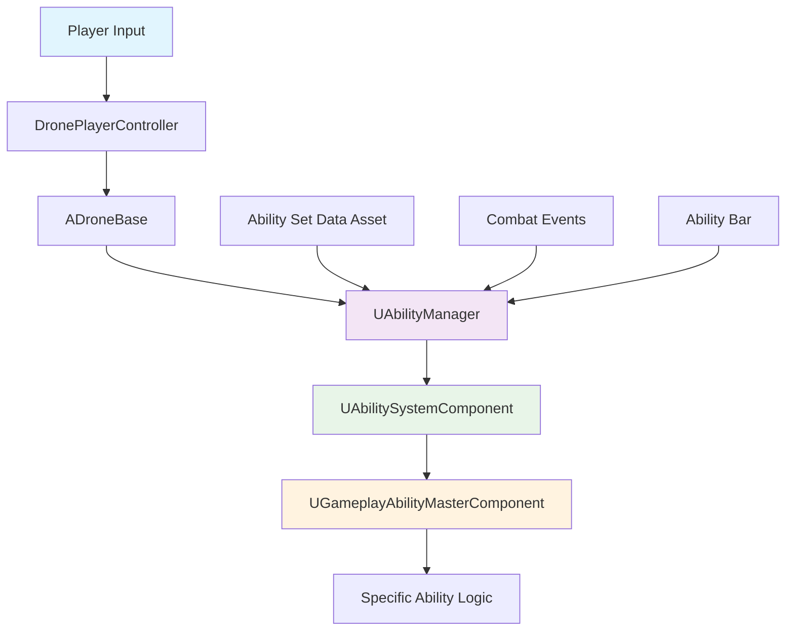
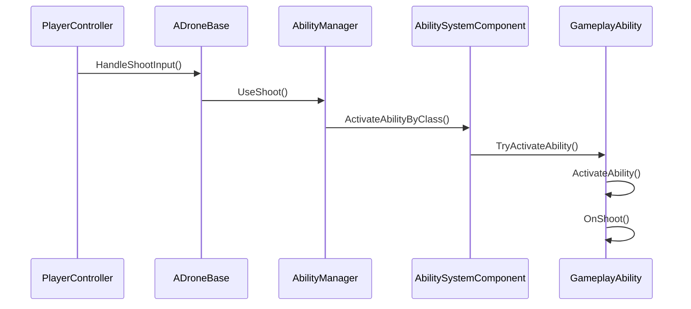
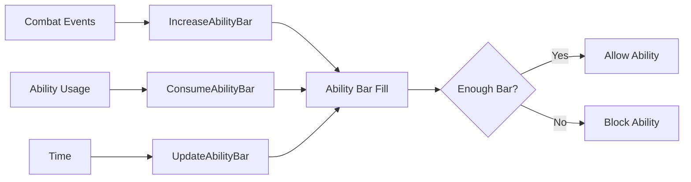

# 🎯 Aerial Combat - Ability System Documentation

## 📋 Table of Contents
- [System Overview](#system-overview)
- [Architecture Flow](#architecture-flow)
- [Core Components](#core-components)
- [Data Flow](#data-flow)
- [Implementation Details](#implementation-details)
- [Usage Examples](#usage-examples)
- [Troubleshooting](#troubleshooting)

---

## 🏗️ System Overview

The Aerial Combat ability system is built on Unreal Engine's **Gameplay Ability System (GAS)** with a custom ability manager layer. It provides:

- **Modular Ability Sets**: Configurable ability collections (Bloodsteal, Fire, Lightning, etc.)
- **Server-Authoritative**: All ability logic runs on the server for multiplayer integrity
- **Blueprint Integration**: Full Blueprint support for designers and artists
- **Ability Bar System**: Resource management with dynamic fill rates
- **GAS Integration**: Leverages Unreal's robust ability framework

### 🎮 Key Features
- ✅ 4 abilities per set (Shoot + 3 Special Abilities)
- ✅ Configurable damage, range, cooldowns
- ✅ Ability bar consumption and regeneration
- ✅ Combat event rewards (kills, zone captures)
- ✅ Server-side replication
- ✅ Blueprint-editable data assets

---

## 🔄 Architecture Flow



### 📊 Component Hierarchy
```
ADroneBase (Pawn)
├── UAbilityManager (Custom Component)
│   ├── UAbilitySetDataAsset (Data)
│   ├── Ability Bar Management
│   └── Combat Event Handling
└── UAbilityComponent (GAS Component)
    └── UGameplayAbilityMasterComponent (Base Ability)
        ├── URaycastShootAbility (Child)
        ├── UProjectileAbility (Child)
        └── UAOEAbility (Child)
```

---

## 🧩 Core Components

### 1. **UAbilityManager** - The Brain
**Location**: `Source/MyProject/Public/AbilityManager.h`

**Responsibilities**:
- Manages ability sets and switching
- Handles ability bar logic
- Processes combat events
- Coordinates with GAS

**Key Functions**:
```cpp
// Ability Set Management
void SetAbilitySet(UAbilitySetDataAsset* NewAbilitySet);
void GrantAbilitySet();
void RemoveCurrentAbilities();

// Ability Usage
void UseShoot();
void UseFirstAbility();
void UseSecondAbility();
void UseThirdAbility();

// Ability Bar Management
void IncreaseAbilityBar(float Amount);
void ConsumeAbilityBar(float Amount);
float GetNormalizedAbilityBar() const;

// Combat Events
void OnKill();
void OnZoneCapture();
void OnEnterCombatZone();
void OnExitCombatZone();
```

### 2. **UAbilitySetDataAsset** - Configuration
**Location**: `Source/MyProject/Public/AbilityManager.h`

**Structure**:
```cpp
USTRUCT(BlueprintType)
struct FAbilityData
{
    FString AbilityName;
    float Damage;
    float Range;
    float Cooldown;
    float AbilityBarCost;
    TSubclassOf<UGameplayAbilityMasterComponent> GameplayAbilityClass;
    bool bRequiresAbilityBar;
    FString Description;
};

UCLASS(BlueprintType)
class UAbilitySetDataAsset : public UDataAsset
{
    FAbilityData ShootAbility;
    FAbilityData FirstAbility;
    FAbilityData SecondAbility;
    FAbilityData ThirdAbility;
    
    // Ability Bar Settings
    float MaxAbilityBar;
    float BarFillRate;
    float CombatBarFillRate;
    float KillBarReward;
    float ZoneCaptureBarReward;
};
```

### 3. **UGameplayAbilityMasterComponent** - Base Ability
**Location**: `Source/MyProject/Public/GameplayAbilityMasterComponent.h`

**Inheritance**: `UGameplayAbility` → `UGameplayAbilityMasterComponent`

**Key Overrides**:
```cpp
virtual void ActivateAbility(...) override;
virtual void OnShoot();
virtual void OnAbilityPrimary();
virtual void OnAbilitySecondary();
virtual void OnAbilityTertiary();
```

---

## 🔄 Data Flow

### 📥 Input Flow


### 🎯 Ability Bar Flow


### 🔄 Replication Flow
```mermaid
graph TB
    A[Server] --> B[HasAuthority()]
    B --> C[Execute Logic]
    C --> D[DOREPLIFETIME]
    D --> E[Client Update]
    
    F[Client Input] --> G[Server RPC]
    G --> A
```

---

## ⚙️ Implementation Details

### 🏗️ Setup Process

#### 1. **Component Creation**
```cpp
// In ADroneBase constructor
AbilityManager = CreateDefaultSubobject<UAbilityManager>(TEXT("AbilityManager"));
AbilityComponent = CreateDefaultSubobject<UAbilityComponent>(TEXT("AbilitySystemComponent"));
```

#### 2. **Ability Set Assignment**
```cpp
// In Blueprint or C++
AbilityManager->SetAbilitySet(BloodstealAbilitySet);
```

#### 3. **GAS Integration**
```cpp
// AbilityManager::GrantAbilitySet()
for (const FAbilityData& Ability : Abilities)
{
    if (Ability.GameplayAbilityClass)
    {
        TSubclassOf<UGameplayAbility> GameplayAbilityClass = Ability.GameplayAbilityClass;
        FGameplayAbilitySpec AbilitySpec(GameplayAbilityClass, 1);
        AbilityComponent->GiveAbility(AbilitySpec);
    }
}
```

### 🎮 Input Binding

#### **DronePlayerController.cpp**
```cpp
void ADronePlayerController::HandleShootInput(const FInputActionValue& Value)
{
    if (AADroneBase* DronePawn = Cast<AADroneBase>(GetPawn()))
    {
        if (DronePawn->AbilityManager)
        {
            DronePawn->AbilityManager->UseShoot();
        }
    }
}
```

### 🔧 Ability Activation

#### **AbilityManager::ActivateAbilityByClass()**
```cpp
void UAbilityManager::ActivateAbilityByClass(TSubclassOf<UGameplayAbilityMasterComponent> AbilityClass)
{
    if (!AbilityComponent || !AbilityClass) return;
    
    // Cast for GAS compatibility
    TSubclassOf<UGameplayAbility> GameplayAbilityClass = AbilityClass;
    
    // Find and activate ability
    FGameplayAbilitySpec* AbilitySpec = AbilityComponent->FindAbilitySpecFromClass(GameplayAbilityClass);
    if (AbilitySpec)
    {
        AbilityComponent->TryActivateAbility(AbilitySpec->Handle);
    }
}
```

---

## 📋 Usage Examples

### 🎨 Creating an Ability Set in Blueprint

1. **Create Data Asset**
   - Right-click in Content Browser
   - Create → Data Asset → Ability Set Data Asset

2. **Configure Abilities**
   ```
   Shoot Ability:
   - Ability Name: "Blood Bullets"
   - Damage: 15.0
   - Range: 800.0
   - Gameplay Ability Class: UBloodBulletAbility
   
   First Ability:
   - Ability Name: "Blood Barrier"
   - Ability Bar Cost: 30.0
   - Gameplay Ability Class: UBloodBarrierAbility
   ```

3. **Assign to Drone**
   ```cpp
   Drone->AbilityManager->SetAbilitySet(BloodstealSet);
   ```

### 🔧 Creating a Custom Ability

#### **Header File** (`UBloodBulletAbility.h`)
```cpp
UCLASS()
class MYPROJECT_API UBloodBulletAbility : public UGameplayAbilityMasterComponent
{
    GENERATED_BODY()
    
protected:
    virtual void OnShoot() override;
    
private:
    void PerformRaycast();
    void ApplyDamage(AActor* HitActor);
};
```

#### **Implementation** (`UBloodBulletAbility.cpp`)
```cpp
void UBloodBulletAbility::OnShoot()
{
    Super::OnShoot();
    
    if (HasAuthority())
    {
        PerformRaycast();
    }
}

void UBloodBulletAbility::PerformRaycast()
{
    // Raycast logic here
    // Apply damage to hit actors
}
```

---

## 🐛 Troubleshooting

### ❌ Common Issues

#### **1. "HasAuthority() not found"**
**Solution**: Add `#include "Engine/Engine.h"`

#### **2. "Cannot convert UGameplayAbilityMasterComponent to UGameplayAbility"**
**Solution**: Use proper casting:
```cpp
TSubclassOf<UGameplayAbility> GameplayAbilityClass = Ability.GameplayAbilityClass;
```

#### **3. "Ability not showing in Blueprint"**
**Solution**: 
- Remove `Abstract` from UCLASS declaration
- Add `BlueprintType` to UCLASS macro

#### **4. "Input not working after ability system"**
**Solution**: Check inheritance conflicts between Aircraft and Drone systems

### 🔍 Debug Logging

#### **Enable Debug Logs**
```cpp
// In AbilityManager.cpp
UE_LOG(LogTemp, Log, TEXT("AbilityManager: UseShoot called"));

// In GameplayAbilityMasterComponent.cpp
UE_LOG(LogTemp, Log, TEXT("GameplayAbilityMasterComponent: OnShoot called"));
```

#### **Check Component Creation**
```cpp
// In ADroneBase constructor
if (AbilityManager)
{
    UE_LOG(LogTemp, Log, TEXT("AbilityManager created successfully"));
}
```

---

## 📊 Performance Considerations

### ⚡ Optimization Tips

1. **Replication**: Only replicate necessary data
2. **Ability Pooling**: Reuse ability instances
3. **Lazy Loading**: Load ability sets on demand
4. **Caching**: Cache frequently accessed data

### 📈 Scalability

- **Ability Sets**: Unlimited ability sets
- **Abilities per Set**: Fixed at 4 (configurable)
- **Players**: Scales with GAS limitations
- **Network**: Server-authoritative design

---

## 🔮 Future Enhancements

### 🚀 Planned Features

1. **Ability Trees**: Skill progression system
2. **Ability Combinations**: Chain abilities together
3. **Environmental Effects**: Terrain-based ability modifications
4. **AI Integration**: AI-controlled ability usage
5. **Visual Effects**: Particle system integration

### 🎨 UI Integration

1. **Ability Bar HUD**: Real-time ability bar display
2. **Cooldown Indicators**: Visual cooldown feedback
3. **Ability Icons**: Dynamic ability set icons
4. **Combat Log**: Ability usage history

---

## 📚 References

### 🔗 Unreal Engine Documentation
- [Gameplay Ability System](https://docs.unrealengine.com/en-US/Gameplay/GameplayAbilitySystem/index.html)
- [Data Assets](https://docs.unrealengine.com/en-US/ProgrammingAndScripting/ProgrammingWithCPP/AssetsAndPackages/DataAssets/index.html)
- [Replication](https://docs.unrealengine.com/en-US/Gameplay/Networking/Replication/index.html)

### 📖 Related Files
- `Source/MyProject/Public/AbilityManager.h`
- `Source/MyProject/Private/AbilityManager.cpp`
- `Source/MyProject/Public/GameplayAbilityMasterComponent.h`
- `Source/MyProject/Private/GameplayAbilityMasterComponent.cpp`
- `Source/MyProject/ADroneBase.h`
- `Source/MyProject/ADroneBase.cpp`

---

*Last Updated: December 2024*
*Version: 1.0*
*Author: AI Assistant*
